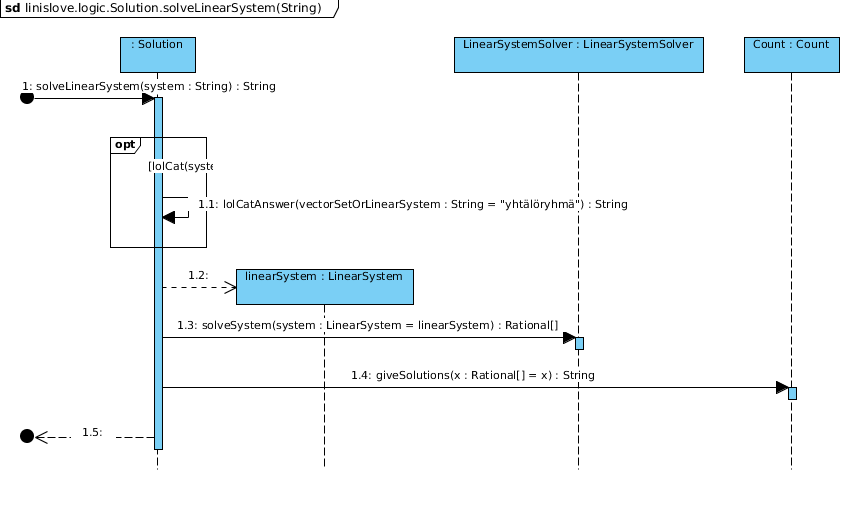
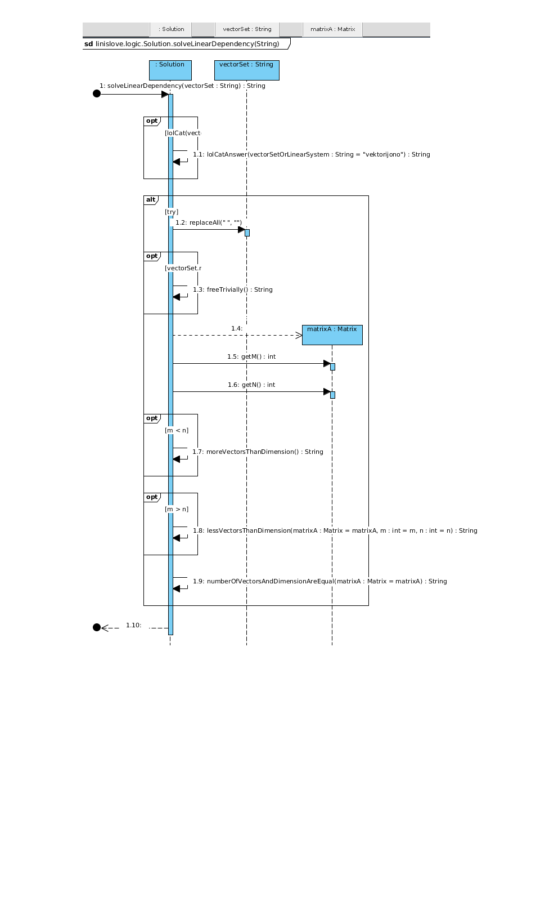

### Aiheen kuvaus
Aihe: Sovellus lineaarialgebran ja matriisilaskennan ongelmien selvittämiseen, esimerkiksi vektorijonon vapauden selvittäminen käyttäjän antamasta vektorijonosta ja kvadraattisen yhtälöryhmän ratkaisuun.

Käyttäjät:
Kaikki käyttäjät samantasoisia.

Toiminnot:
* Käyttäjä antaa syötteenä vektorijonon ja ohjelma ratkaisee onko vektorijono lineaarisesti riippumaton eli vapaa vai riippuvainen eli sidottu.
* Käyttäjä antaa syötteenä kvadraattisen yhtälöryhmän ja ohjelma antaa ratkaisun tai ilmoittaa ettei ratkaisua tai yksikäsitteistä ratkaisua ole olemassa.

Erityistä:
Vektorien komponentit syötetään rationaalilukuina ja determinantti lasketaan rationaalilukuna. Näin determinantille saadaan täysin tarkka arvo ja siitä voidaan siten tehdä suoraan johtopäätös vektorijonon vapauteen liittyen.
Syötteenä voi myös antaa desimaaliluvun jossa pilkun asemasta käytetään pistettä. Sovellus olettaa niiden olevan tarkkoja lukuja ja muuntaa luvun rationaaliluvuksi. Desimaalilukusyötettä ei muunneta missään vaiheessa liukuluvuksi, vaan suoraan merkkijonosyötteestä rationaaliluvuksi.

